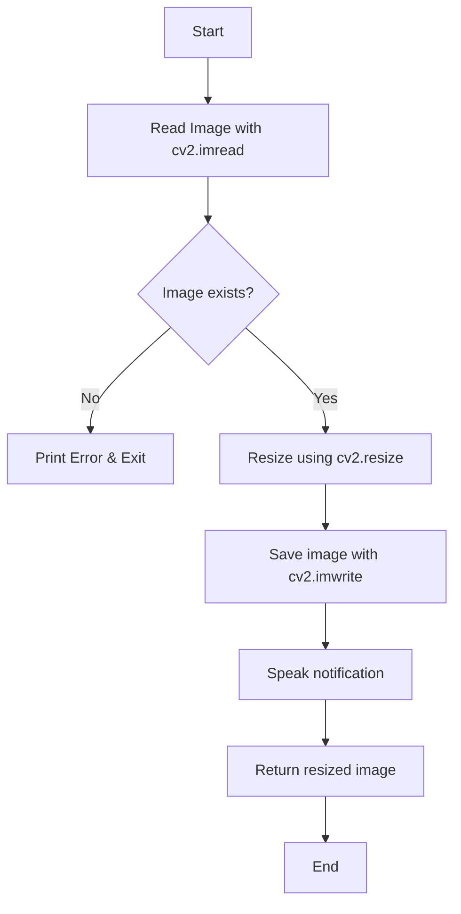
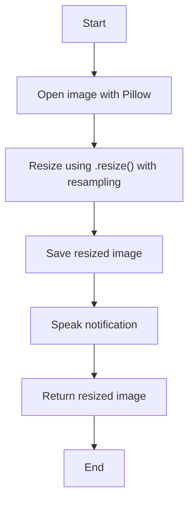
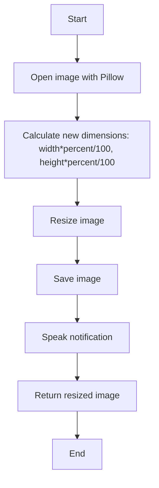
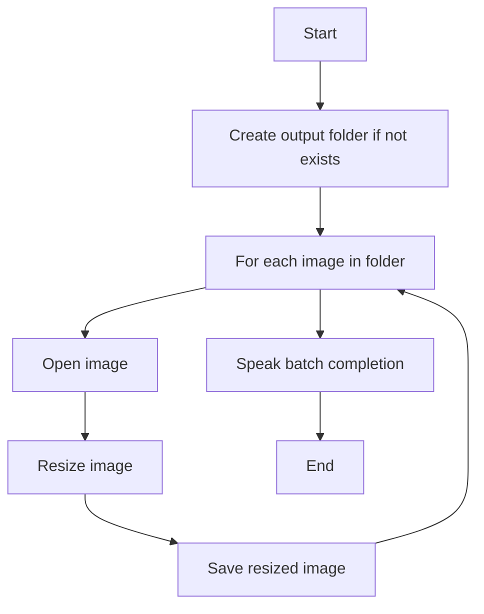
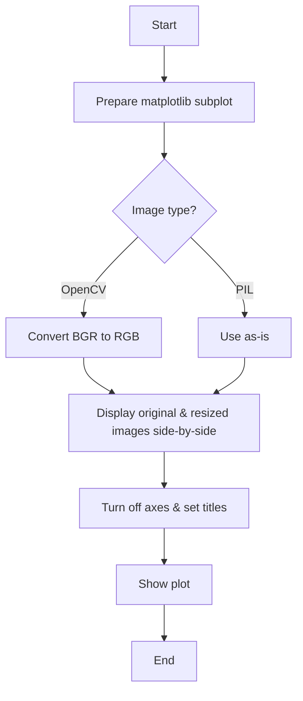
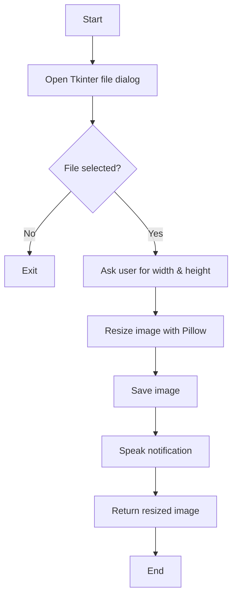
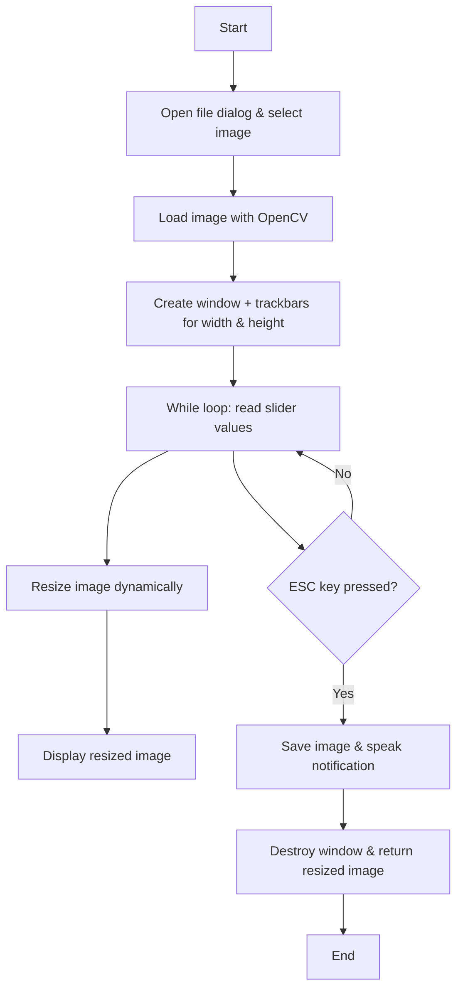
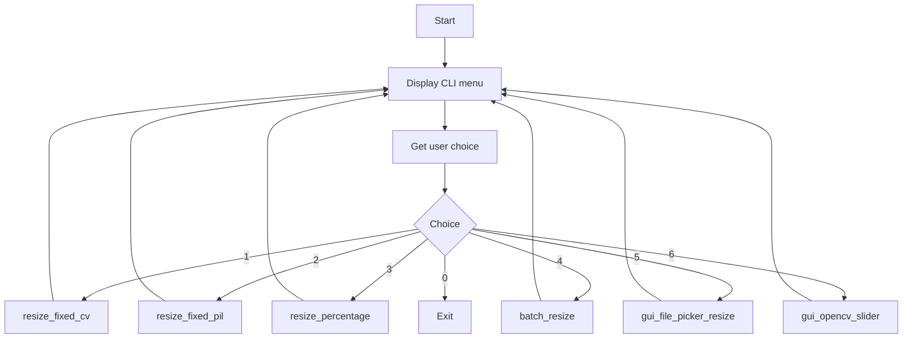

# Mega Image Resizer 🖼️

## Description
Mega Image Resizer is a Python program to resize images in multiple ways using **CLI (Command-Line Interface)** or **GUI (Graphical User Interface)**.

It demonstrates:

- **Core Python concepts**  
- **Image processing** using **OpenCV** and **Pillow**  
- **GUI design** using **Tkinter**  
- **Text-to-speech notifications** with `pyttsx3`  
- **Side-by-side image comparison** using `matplotlib`  

---

## 📚 Purpose
The project aims to help you:

- Learn **image processing** in Python  
- Understand **OpenCV vs Pillow** resizing techniques  
- Learn **GUI programming** (Tkinter sliders, file pickers)  
- Use **pyttsx3** for notifications  
- Compare images visually using **matplotlib**  
- Automate **batch resizing**  
- Explore **functions, modules, and classes** step by step  

---

## 📦 Modules & Their Meanings

| Module | Meaning / Use in Programming | Why Used Here |
|--------|----------------------------|---------------|
| `os` | Operating system interface | Read folders and save batch-resized images |
| `cv2` | OpenCV library for image/video processing | Resize images, create sliders GUI |
| `PIL.Image` | Pillow (Python Imaging Library) module | Smooth resizing, open/save images |
| `pyttsx3` | Python text-to-speech library | Speak notifications aloud |
| `tkinter` | Standard Python GUI library | File dialogs, input dialogs |
| `matplotlib.pyplot` | Plotting library | Display images side-by-side for comparison |

---

## ⚙️ Key Concepts Explained

| Term | Meaning |
|------|---------|
| `function` | A block of reusable code performing a task |
| `parameter` | Input value for a function, e.g., width, height |
| `return` | Output of a function |
| `variable` | Named storage for a value, e.g., `img`, `w`, `h` |
| `if / elif / else` | Conditional statements |
| `for` / `while` | Loops to repeat code |
| `list` | Ordered collection of items |
| `string` | Text data, e.g., `"Path: "` |
| `int` | Integer data type |
| `object` | Instance of a class, e.g., `Image.open(...)` |
| `method` | Function attached to an object, e.g., `img.resize(...)` |

---

## 🖥️ Function-by-Function Explanation

**Function-by-Function Explanation with Methods Used**

---

### 1️⃣ `speak(text)`

**Purpose:** Converts text to speech.

**Code:**

```python
engine = pyttsx3.init()
engine.say(text)
engine.runAndWait()
```

**Explanation:**

* `pyttsx3.init()`: Initializes the TTS engine.
* `engine.say(text)`: Queues text to be spoken.
* `engine.runAndWait()`: Runs the TTS engine until all queued speech is spoken.

---

### 2️⃣ `resize_fixed_cv(image_path, width, height, output_name)`

**Purpose:** Resize images using OpenCV.

**Code:**

```python
img = cv2.imread(image_path)
resized = cv2.resize(img, (width, height))
cv2.imwrite(output_name, resized)
```

**Explanation:**

* `cv2.imread(path)`: Reads an image as a NumPy array.
* `cv2.resize(img, (w, h))`: Resizes the image to fixed width and height.
* `cv2.imwrite(path, img)`: Saves the NumPy image array to a file.
* OpenCV stores images in BGR format.

---

### 3️⃣ `resize_fixed_pil(image_path, width, height, output_name)`

**Purpose:** Resize using Pillow.

**Code:**

```python
img = Image.open(image_path)
resized = img.resize((width, height), RESAMPLE_FILTER)
resized.save(output_name)
```

**Explanation:**

* `Image.open(path)`: Opens an image file as a Pillow `Image` object.
* `img.resize((w,h), RESAMPLE_FILTER)`: Resizes image using high-quality resampling (LANCZOS).
* `resized.save(output_name)`: Saves the resized image to disk.
* `RESAMPLE_FILTER`: Modern alternative to deprecated `Image.ANTIALIAS`.

---

### 4️⃣ `resize_percentage(image_path, percent, output_name)`

**Purpose:** Resize image by a percentage.

**Code:**

```python
w, h = img.size
resized = img.resize((int(w * percent / 100), int(h * percent / 100)), RESAMPLE_FILTER)
```

**Explanation:**

* `img.size`: Returns `(width, height)` of the image.
* `int(w * percent/100)`: Computes new width as a percentage of original.
* `img.resize((new_w, new_h), RESAMPLE_FILTER)`: Resize with smooth resampling.

---

### 5️⃣ `batch_resize(folder, width, height, output_folder)`

**Purpose:** Resize all images in a folder.

**Code:**

```python
os.makedirs(output_folder, exist_ok=True)
for f in os.listdir(folder):
    if f.lower().endswith((".png", ".jpg", ".jpeg")):
        img = Image.open(os.path.join(folder, f))
        img.resize((width, height)).save(os.path.join(output_folder, f"resized_{f}"))
```

**Explanation:**

* `os.makedirs(folder, exist_ok=True)`: Creates folder if it doesn’t exist.
* `os.listdir(folder)`: Lists all files in a folder.
* `str.lower()`: Converts filename to lowercase.
* `str.endswith()`: Checks file extension.
* `os.path.join(folder, f)`: Combines folder and filename into a path.

---

### 6️⃣ `display_with_matplotlib(original, resized)`

**Purpose:** Show original and resized images side by side.

**Code:**

```python
fig, axs = plt.subplots(1, 2, figsize=(10, 5))
axs[0].imshow(original)
axs[1].imshow(resized)
plt.show()
```

**Explanation:**

* `plt.subplots(1, 2)`: Creates a figure with 1 row, 2 columns.
* `axs[i].imshow(img)`: Displays an image in the subplot.
* `plt.show()`: Renders the figure.
* If using OpenCV images, convert from BGR to RGB using `cv2.cvtColor(img, cv2.COLOR_BGR2RGB)`.

---

### 7️⃣ `gui_file_picker_resize()`

**Purpose:** GUI for selecting and resizing an image using Tkinter.

**Code:**

```python
file_path = filedialog.askopenfilename(title="Select image")
w = simpledialog.askinteger("Width", "Enter new width")
h = simpledialog.askinteger("Height", "Enter new height")
img = Image.open(file_path)
resized = img.resize((w, h), RESAMPLE_FILTER)
resized.save("resized_gui.jpg")
```

**Explanation:**

* `filedialog.askopenfilename()`: Opens a file picker dialog.
* `simpledialog.askinteger(title, prompt)`: Prompts user for integer input.
* `Image.open()`: Opens the selected image.
* `img.resize()`: Resize using Pillow.
* `resized.save()`: Save resized image.

---

### 8️⃣ `gui_opencv_slider()`

**Purpose:** GUI slider to dynamically resize image using OpenCV trackbars.

**Code:**

```python
cv2.namedWindow("Resize Slider")
cv2.createTrackbar("Width", "Resize Slider", img.shape[1], img.shape[1]*2, lambda x: None)
while True:
    w = cv2.getTrackbarPos("Width", "Resize Slider")
    resized = cv2.resize(img, (w, h))
    cv2.imshow("Resize Slider", resized)
```

**Explanation:**

* `cv2.namedWindow(name)`: Creates a window.
* `cv2.createTrackbar(name, window, init, max, callback)`: Creates a slider.
* `cv2.getTrackbarPos(name, window)`: Reads current slider value.
* `cv2.resize(img, (w,h))`: Resize image using slider values.
* `cv2.imshow(window, img)`: Show updated image in window.
* `cv2.waitKey(1) & 0xFF == 27`: Exit on ESC key.

---

### 9️⃣ `main_menu()`

**Purpose:** Provides CLI menu to select different resize methods.

**Explanation:**

* `input()`: Reads user input.
* Conditional `if-elif-else`: Determines which function to call.
* Loops until user exits.
* Calls display or GUI functions as needed.

---

This is **modern, professional, and includes purpose + method explanation for every function and key method used**.


## Function Flowcharts (Mermaid) for Mega Image Resizer

### Function Flow: resize_fixed_cv



### Function Flow: resize_fixed_pil



### Function Flow: resize_percentage



### Function Flow: batch_resize



### Function Flow: display_with_matplotlib



### Function Flow: gui_file_picker_resize



### Function Flow: gui_opencv_slider



### Function Flow: main_menu


